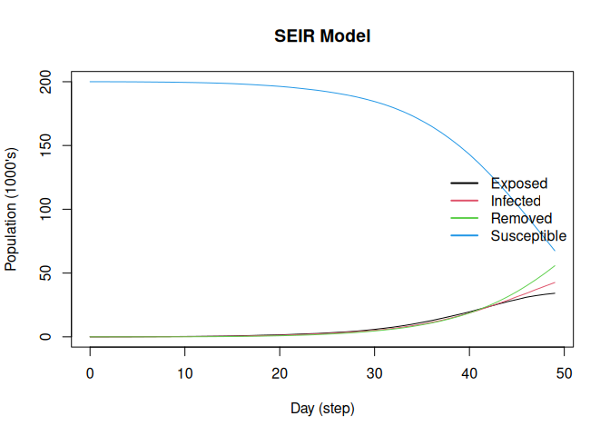

# Simulating data with epiworldR

## Setup

``` r
library(epiworldR)
```

    Thank you for using epiworldR! Please consider citing it in your work.
    You can find the citation information by running
      citation("epiworldR")

``` r
n <- 200000

# Creating a network-based SEIR model
model_seir <- ModelSEIR(
    name = "COVID-19", prevalence = 10/n,
    transmission_rate = 0.05,
    recovery_rate = 1/7, incubation_days = 4
    )

# Adding a small world population
agents_smallworld(
  model_seir,
  n = n,
  k = 20,
  d = FALSE,
  p = .01
)
```

## Running and printing

``` r
run(model_seir, ndays = 100, seed = 1912)
```

    _________________________________________________________________________
    Running the model...
    ||||||||||||||||||||||||||||||||||||||||||||||||||||||||||||||||||||||||| done.

``` r
summary(model_seir)
```

    ________________________________________________________________________________
    ________________________________________________________________________________
    SIMULATION STUDY

    Name of the model   : Susceptible-Exposed-Infected-Removed (SEIR)
    Population size     : 200000
    Agents' data        : (none)
    Number of entities  : 0
    Days (duration)     : 100 (of 100)
    Number of viruses   : 1
    Last run elapsed t  : 491.00ms
    Last run speed      : 40.68 million agents x day / second
    Rewiring            : off

    Global events:
     (none)

    Virus(es):
     - COVID-19

    Tool(s):
     (none)

    Model parameters:
     - Incubation days   : 4.0000
     - Recovery rate     : 0.1429
     - Transmission rate : 0.0500

    Distribution of the population at time 100:
      - (0) Susceptible : 199990 -> 41
      - (1) Exposed     :     10 -> 0
      - (2) Infected    :      0 -> 242
      - (3) Removed     :      0 -> 199717

    Transition Probabilities:
     - Susceptible  0.98  0.02     -     -
     - Exposed         -  0.75  0.25     -
     - Infected        -     -  0.86  0.14
     - Removed         -     -     -  1.00

``` r
plot(model_seir, main = "SEIR Model")
```


